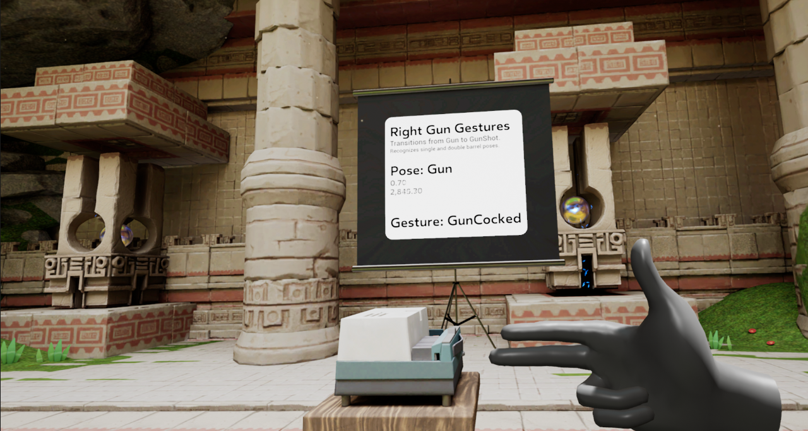
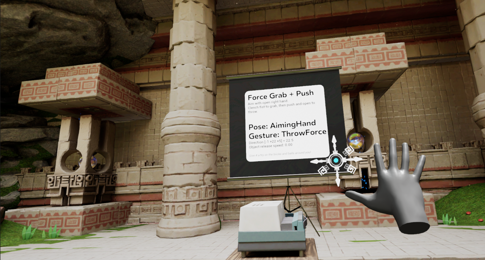

# Oculus Hand Pose Showcase

This Oculus DevTech showcase demonstrates how one can leverage the raw hand
data provided by the Oculus Hands API to recognize hand poses and gestures
in an Unreal Engine project.  It comes complete with music, sound effects,
visual effects, blueprints and C++ code to help you get started and,
hopefully, inspire you to develop your own title for the Oculus platform.

To make the showcase relevant to actual development needs, we are bringing
to UE4 the *force grab* and *force throw* hand gameplay mechanics from
*Tiny Castles*, a demo written in C# for the Unity game engine by our Menlo
Park Strike Team.

## The Demo

Your archaeological team is studying the mysterious magic that is active in
this ancient hall.

### 1. Far Field Selection

You have discovered that within these walls your right hand can project an
aiming symbol in the direction of your open palm.


As you aim around, the symbol aligns itself to the surface normal.  When
your aim comes close to a selectable object (e.g. a brick), the aiming
reticle disappears and is replaced by a beam of energy that jumps from
the hand to the selected object.  The object also glows with that energy
which makes it easy to identify.


When you slightly close your hand, the beam disappears allowing you to
reopen your palm to select another nearby object.

### 2. Force Grab

While you have an object selected, you can grab it by clenching your fist
and the selected object flies to your hand.


### 2. Simple Drop and Force Throw

A grabbed object will float next to your hand as long as your hand is
clenched.  The object is released when you open your hand, and will simply
drop to the ground unless your hand is in motion at that time.

A special *force throw* effect is triggered when your hand releases the
object above some speed.  You know when that happens because it triggers
both an audio and a visual effect, as can be seen below.


### 3. The Projector

Beyond experiencing the magic of grabbing and throwing objects in VR,
our archaeological site has an educational side.  When you look to your
right, you will see a projector and a screen.

The first gesture that you will learn operates the projector.
To go to the next slide, first point your right hand at the screen like
this:


You hand will turn blue indicating that the hand initial position has been
recognized.  Note that you also need to be looking at the screen for this to
work.  To go to the next slide, just flick your hand like so:


The projector will react to your gesture and move to the next side.  To go
to the previous slide, do the same gesture using your left hand.

### 4. The Slides

a. Left Hand Poses

   The first slide is the only one tracking your left hand.  It is comparing
   your left hand bone angles to a few classic reference poses.

   

   Below the list of poses recognized, there are four lines: the recognized
   hand pose, the confidence level from 0.0 to 1.0, the raw error value and
   how long the pose has been held.

b. Right Hand American Sign Language Numbers

   The second slide recognizes ASL numbers.  There are no ambiguities and
   every number is easily distinguished from one another.

   

   Interestingly, the slides look better on Quest than when running on a PC
   running the UE4 editor.  This screenshot is from a PC.

c. Right Hand American Sign Language Letters

   Next are the ASL letters.  This example is meant to illustrate some of
   the limits of the hand bone tracking system, in particular
   self-occlusion: when fingers cannot be seen by the Quest cameras because
   they are hidden behind the hand or the other fingers.

   

   As you play with this slide, you will appreciate the difficulty of
   distinguishing between some letters.  The confidence level (and the raw
   error) will be useful here as it will help you understand how close your
   hand pose is to the reference pose recognized.

d. Right Hand Gun Gestures

   The fourth slide is about gesture recognition, that is the recognition
   of a sequence of hand poses.

   

   Two poses are recognized: the *Gun* pose, with the thumb up, and the
   *Gun Shot* with the thumb down.  The transition from *Gun* to *Gun Shot*
   is the *Gun Fired* gesture, while the reverse transition is the
   *Gun Cocked* gesture.

e. Right Hand Force Grab + Push

   Finally, the fifth slide is hooked to the *force grab* and *force throw*
   gestures.

   

   The slide not only shows the poses and gestures recognized, but also the
   amplitude of the gesture as a displacement vector.

## The Blueprints

The following sections describe the key blueprints that bring the Hand Pose
Showcase to life.

Most of them depend on the OculusHandTools plugin that is documented
[here](./Plugins/OculusHandTools/Documentation/OculusHandTools.md).
It is recommended that you have at least a cursory understanding of the
plugin before reading further.

### 1. VRCharacter

VRCharacter represents the player.  Its main components that are of interest
to us are the *MotionControllerLeft* and *MotionControllerRight*.  They
represent our hands in VR.


#### Pose and Gesture Recognizers

Attached to each hand you will find various
[pose recognizers](./Plugins/OculusHandTools/Source/OculusHandPoseRecognition/Public/HandPoseRecognizer.h),
and attached to some of them
[gesture recognizers](./Plugins/OculusHandTools/Source/OculusHandPoseRecognition/Public/HandGestureRecognizer.h).
Please look at the
[OculusHandTools plugin documentation](./Plugins/OculusHandTools/Documentation/OculusHandTools.md)
to understand how those are configured.

#### Changing Slides

Let's look at how these hand pose and gesture recognizers can be used.  If
we look at the gesture that allows one to change slides, one option is to
use the *Wait for Gesture* node:


This section of the VRCharacter blueprint is not active, since there are no
incoming execution paths, but is shown as one way to wait for a gesture to
be recognized.  Instead of this, we are explicitly inspecting the state of
recognition of the *Next Slide* gesture so that we can have the hand turn blue
when the gesture is in progress:


In a different part of the VRCharacter's blueprint, you will see how we
handle the slide changing gestures when they are recognized by calling
events on the projector screen:


#### Grabbing and Throwing

Arguably the most complex section of the VRCharacter's blueprint is how we
handle *Force Grab* and *Force Throw*.  We encourage you to explore that
part of the blueprint directly as it is large and cannot fit in a readable
way in this document.  One way to help your understanding of what is going
on is to look for the places where the three custom *Interactable* events
are called: *Interaction1* is called when the object is initially grabbed
but has not yet traveled to the player's hand, *Interaction2* is called
when the object has reached the player's hand, and *Interaction3* is called
when the object is released.

When you look at the throwing section of the blueprint, you will see how
we generate additional impulse force on objects based on the velocity of
the gesture:


The gesture vector is measured from a point near the end of your clenched
fist and a point near the beginning of your hand letting go of the object.
Through testing we have determined that when that vector is shorter than
20cm, that we are dealing with a normal throw and the impulse is done
with a basic force multiplier of 1.0.  When your gesture goes above 20cm
and up to 40cm, we have an exponential increase of force that goes from
1.0 to a maximum of 4.0.

We encourage you to experiment with different thresholds and multipliers!

#### Far-Field Selector

In the showcase, we have attached one far-field selector to the right hand
of the VRCharacter.  The aiming of that selector has been adjusted manually
relative to hand it is attached to.


Looking at its configuration, we have configured this instance with a
game-specific *aiming actor* and a custom *aiming beam* visual effect.

### 2. Interactable Objects

The showcase has 3 interactable object types.  They are typically made
of one mesh component that emits overlap events for the *Interactable*
trace channel and a few audio and visual effect components.

They are meant to be thrown around and bounce of surfaces.  Part of their
blueprints handles hit events to produce collision sounds and visuals.

The other half of their behavior handles *Interactable* events.
*Begin Interaction* and *End Interaction* are generated by the far-field
selector itself and are considered system events.  The other three events
(*Interaction1*, *Interaction2* and *Interaction3*) are generated by
the VRCharacter's blueprint and are considered user events.

### 3. The Projector Screen

The projector screen defines two events for moving to the next or
the previous slide.  this part of the code only changes the index of the
slide that should be currently shown.


The screen is regularly updated through events.  As an example, here's the
projector blueprint section for the first screen:


It simply checks for the index of the currently displayed slide and updates
the corresponding UI variables.

### 4. The Hand Debugger

To visualize the raw values returned the by Oculus Hands API, we have
placed a HandDebugActor in the level.  It is hidden by default and can
be activated with the standard left hand system gesture: look at the
palm of your left while you pinch your thumb and index together.


This screen is a stereo layer in screen space, so it will stay in the
center of your field of view.

At the top, next to each hand, you will either see **high** or **low**
confidence.  The highlighted hand is the dominant one.  The finger values
left and right of the Oculus logo are the pinch strengths for each finger.

The rest of that screen shows the bone angles in pitch/yaw/roll values.
As you can see, the wrist and forearm angles are null, which explains why
we get them from the controller we the pose recognizer is attached to.

### 5. Hand Tracking Frequency

The Quest 2 has the capability to double the standard hand tracking frequency
from 30Hz to 60Hz.  At the time of this writing, this can be enabled in your
project settings under **Plugins - OculusVR - Mobile - Hand Tracking Frequency**.


## What's Next?

It's up to you!   We hope that this showcase will inspire your own work and
that you will come up with compelling new pose and gesture VR experiences.

Please look at our
[plugin documentation](./Plugins/OculusHandTools/Documentation/OculusHandTools.md)
and explore our code.  You are free to reuse any part of the showcase in
your own projects and feel especially free to reuse our plugin code as is or
adapt it for your own purposes!

## How to Use

### Load the project

First, ensure you have Git LFS installed by running this command:
```sh
git lfs install
```

Then, clone this repo using the "Code" button above, or this command:
```sh
git clone https://github.com/oculus-samples/Unreal-HandPoseShowcase
```

### Launch the project in the Unreal Editor using one of the following options.

#### Epic Games Launcher with MetaXR plugin

The easiest way to get started is to use the prebuilt Unreal Engine from the Epic Games Launcher, with MetaXR plugin.

1. Install the [Epic Games Launcher](https://www.epicgames.com/store/en-US/download)
2. In the launcher, install UE5 (recommended).
3. Download and install the MetaXR plugin from the [Unreal Engine 5 Integration download page](https://developer.oculus.com/downloads/package/unreal-engine-5-integration).
3. Launch the Unreal Editor
4. From "Recent Projects", click "Browse" and select `HandPoseShowcase.uproject`

#### Meta fork of Epic’s Unreal Engine

The Meta fork of Epic’s Unreal Engine will give you the most up to date integration of Oculus features. However, you must build the editor from its source.

Follow the instructions on [Accessing Unreal Engine source code on GitHub](https://www.unrealengine.com/en-US/ue-on-github) to obtain:
- an Epic account
- a GitHub account
- authorization to access the Unreal Engine source repository
Disregard instructions on downloading Epic’s Unreal Engine source code as you will be building the Meta fork of Epic’s Unreal Engine source.

Make sure you have Visual Studio installed properly:
- Launch the Visual Studio Installer and click Modify for the Visual Studio version you want to use.
- Under the Workloads tab, click Game development with C++ if it isn’t checked and then click Modify.

1. Download the source code from the [Meta fork of Epic’s Unreal Engine on GitHub](https://github.com/Oculus-VR/UnrealEngine).
2. Follow Epic’s instructions on [Building Unreal Engine from Source](https://docs.unrealengine.com/5.2/en-US/building-unreal-engine-from-source/) to complete the process.

Depending on your machine, the build may take awhile to complete.

# Licenses
The Meta License applies to the SDK and supporting material. The MIT License applies to only certain, clearly marked documents. If an individual file does not indicate which license it is subject to, then the Meta License applies.
